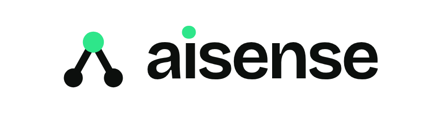
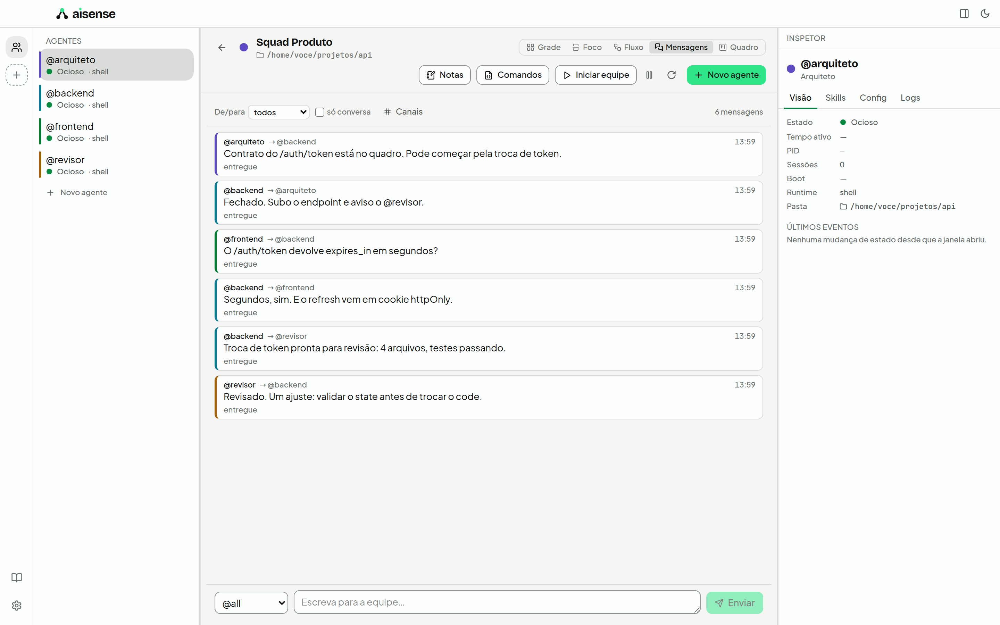
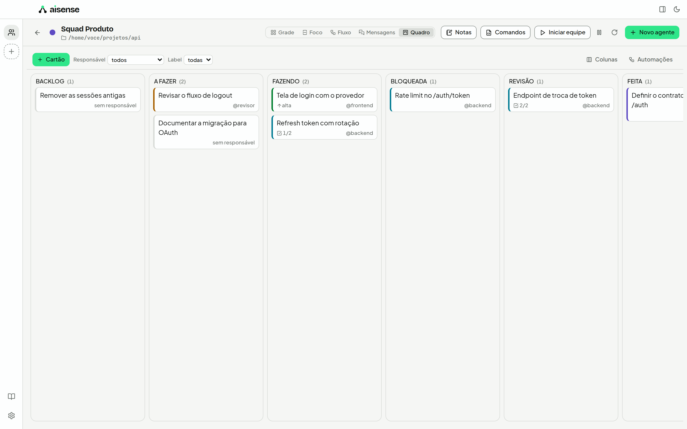

<p align="center">
  <picture>
    <source media="(prefers-color-scheme: dark)" srcset="assets/readme/logo-escuro.png">
    
  </picture>
</p>

<h3 align="center">Uma equipe. Muitos agentes.</h3>

<p align="center">
  Monte equipes de agentes de IA em terminais reais que <b>conversam entre si</b>,<br>
  dividem um quadro de tarefas e sobem já sabendo o seu papel.
</p>

<p align="center">
  <a href="#instalação">Instalação</a> ·
  <a href="#primeiros-passos">Primeiros passos</a> ·
  <a href="#como-funciona">Como funciona</a> ·
  <a href="docs/guia/">Guias</a>
</p>

<p align="center">
  
  
  
</p>

<p align="center">
  <picture>
    <source media="(prefers-color-scheme: dark)" srcset="assets/readme/sala-mensagens-dark.png">
    
  </picture>
</p>

---

## Por que o AISENSE

Quem usa IA para trabalhar de verdade acaba com **seis abas de terminal abertas**: Claude Code numa,
Codex na outra, OpenCode, mais uns shells soltos. Cada uma não sabe o que as outras estão fazendo,
precisa ouvir de novo "você é o revisor, siga estas regras" a cada início, e **você** vira o fio
entre elas — copiando a resposta de uma e colando na outra.

O AISENSE é o **ambiente de trabalho para equipes de agentes de IA**. Você monta a equipe uma vez;
os agentes trabalham juntos, e você acompanha tudo numa tela só.

## O que ele faz

**👥 Equipes com missão.** Uma equipe tem missão, pasta de trabalho, memória e quadro próprios —
"Squad Produto", "Time de Infra", "Pesquisa de Mercado". Comece de um modelo (Dupla Dev, Squad
completo, Pesquisa, Operação) ou do zero.

**🖥️ Cada agente é um terminal de verdade.** Um processo real num PTY real, com a IA que você já usa:
Claude Code, Codex, OpenCode, Gemini CLI, um shell puro ou qualquer comando. Cores, TUIs, `htop`,
editores — se funciona no seu terminal, funciona aqui. Veja 1, 4 ou 9 terminais lado a lado, ou foque
em um com os outros em miniatura.

**💬 Os agentes conversam entre si.** Todo agente tem um endereço (`@backend`) e fala com os colegas
pela CLI `aisense` ou pelo servidor MCP: manda recado, pergunta e espera a resposta, avisa a equipe,
posta num canal. Toda mensagem aparece na linha do tempo — nada acontece escondido.

**🧠 Nasce sabendo o seu papel.** Skills em Markdown (compatíveis com as do Claude Code) dizem a cada
agente quem ele é, quem são os colegas e como trabalhar. O terminal sobe já configurado — sem colar
o mesmo prompt toda vez.

**📋 Um quadro que os agentes usam.** Kanban por equipe onde os próprios agentes pegam o próximo
cartão, movem, comentam e pedem revisão — com limite de trabalho em andamento, dependências e um
portão de revisão antes do "feito".

**🧭 Um coordenador, se você quiser.** Um agente `@coordenador` quebra o objetivo em cartões,
distribui pelo papel de cada um e fecha o ciclo. Ações estruturais (criar agente, mudar autonomia)
viram **proposta** para você aprovar.

<p align="center">
  <picture>
    <source media="(prefers-color-scheme: dark)" srcset="assets/readme/sala-quadro-dark.png">
    
  </picture>
</p>

## Como funciona

```
 você ── escreve a missão ──▶ @coordenador
                                   │  aisense task add · aisense ask
                    ┌──────────────┼──────────────┐
                    ▼              ▼              ▼
                @backend       @frontend       @revisor      ← cada um é um terminal real,
              (Claude Code)   (OpenCode)       (Codex)          com a IA que você escolheu
                    │              │              │
                    └─── barramento do AISENSE ───┘          ← mensagens, canais e quadro
                                   │
                  linha do tempo · quadro · fluxo            ← o que você acompanha
```

Dentro do terminal de qualquer agente, a equipe está a um comando de distância:

```bash
aisense agents                                   # quem está na equipe e o que cada um faz
aisense ask @revisor "revisa o diff de HEAD~1"   # pergunta e espera a resposta
aisense send #pesquisa "achei 3 fontes novas"    # posta no canal
aisense task next                                # o próximo cartão que é seu
```

Runtimes com MCP (como Claude Code) recebem as mesmas ferramentas pelo `aisense-mcp`, sem digitar
comando nenhum.

## Para quem

| Perfil | Uso típico |
|---|---|
| **Dev solo** | Dupla implementador + revisor no mesmo repositório, cada um na sua bancada (`git worktree`) |
| **Tech lead** | Um agente por serviço e um coordenador distribuindo o trabalho pelo quadro |
| **Pesquisa** | Vários agentes em fontes diferentes, um sintetizador consolidando o canal |
| **Operações** | Terminais de longa duração monitorando, um agente triando alertas |

## Princípios

- **Local-first.** Seus dados ficam no seu disco. Sem conta, sem nuvem; a única conexão que o app faz
  é procurar atualização — e dá para desligar.
- **Sem lock-in.** O AISENSE não é cliente de nenhuma IA: ele **hospeda** a CLI que você já usa. Uma IA
  nova é um arquivo TOML, sem recompilar nada.
- **Você no volante.** Pausar, interromper, assumir o terminal e aprovar propostas estão sempre à mão.
  Autonomia é opcional, por agente.
- **Tudo visível.** Toda mensagem entre agentes é registrada e auditável na linha do tempo.

## Status

O AISENSE está em desenvolvimento ativo: equipes, terminais, skills, barramento, quadro, coordenação,
configurações, atualização automática e o empacotamento para os três sistemas estão prontos. A
**primeira versão pública (v0.1.0)** está sendo preparada — enquanto ela não sai, dá para compilar a
partir do código (veja [Desenvolvimento](#desenvolvimento)).

## Instalação

Quando a v0.1.0 sair, baixe o instalador do seu sistema na página de
[Releases](https://github.com/jjoaquim0/AISENSE/releases/latest):

| Sistema | Arquivo | Como instalar |
|---|---|---|
| macOS 11+ (Apple Silicon e Intel) | `AISENSE_<versão>_universal.dmg` | Abra o `.dmg` e arraste o AISENSE para Aplicativos |
| Windows 10/11 | `AISENSE_<versão>_x64-setup.exe` (ou o `.msi`) | Execute o instalador; não precisa de administrador no `-setup.exe` |
| Ubuntu, Debian e derivados | `AISENSE_<versão>_amd64.deb` | `sudo apt install ./AISENSE_<versão>_amd64.deb` |
| Qualquer Linux x86_64 | `AISENSE_<versão>_amd64.AppImage` | `chmod +x AISENSE_*.AppImage` e execute |

O AISENSE hospeda as CLIs de IA; ele não traz nenhuma. Instale pelo menos uma das que você quer usar
(sem nenhuma, dá para começar com agentes de terminal puro):

| IA | Instalação |
|---|---|
| Claude Code | `npm i -g @anthropic-ai/claude-code` |
| Codex CLI | `npm i -g @openai/codex` |
| OpenCode | `npm i -g opencode-ai` |
| Gemini CLI | `npm i -g @google/gemini-cli` |

As versões novas chegam sozinhas: o app confere se há atualização ao abrir e pergunta antes de
instalar. Dá para desligar em **Configurações → Avançado**.

## Primeiros passos

1. **Abra o AISENSE.** O primeiro passo mostra quais IAs ele encontrou no seu computador. Se alguma
   que você instalou não aparece, veja [Solução de problemas](docs/guia/problemas.md#runtimes).
2. **Escolha o tema** (dá para trocar depois com `⌘⇧D`/`Ctrl+Shift+D`).
3. **Crie a primeira equipe:** um nome, a pasta do projeto em que ela vai trabalhar e um modelo —
   *Dupla Dev* (`@dev` e `@revisor`), *Squad completo* (`@arquiteto`, `@backend`, `@frontend`,
   `@revisor`), *Pesquisa*, *Operação* ou *Vazio*. A equipe é criada e iniciada: os terminais sobem
   na **Sala da Equipe**.
4. **Dê a missão.** Clique no terminal de um agente e fale com a IA como faria num terminal comum.
   Cada agente já nasceu sabendo quem é, quem são os colegas e como falar com eles.
5. **Veja a equipe conversando.** Os agentes usam a CLI `aisense` (ou o servidor MCP) entre si —
   `aisense send @revisor "pronto para revisar"`, `aisense ask @arquiteto "qual contrato?"`. Tudo
   aparece na vista **Mensagens**; o trabalho, na vista **Quadro**; quem fala com quem, na vista
   **Fluxo**. Você também escreve na linha do tempo como `@voce`.

Para ir além:

- [Criar um adaptador para outra IA](docs/guia/adaptadores.md)
- [Criar e atribuir skills](docs/guia/skills.md)
- [Solução de problemas](docs/guia/problemas.md)
- `⌘K` / `Ctrl+K` abre a paleta com todos os comandos do app.

## Desenvolvimento

O estado do projeto e o plano por fases estão em [`docs/ESTADO.md`](docs/ESTADO.md) e
[`docs/INDEX.md`](docs/INDEX.md). Para compilar:

```bash
pnpm install
pnpm app          # app em modo de desenvolvimento (Tauri)
pnpm app:build    # instaladores do seu sistema em target/release/bundle/
pnpm test         # testes do front e do core
```

No Linux, o app precisa de `libwebkit2gtk-4.1-dev libgtk-3-dev libayatana-appindicator3-dev
librsvg2-dev libsoup-3.0-dev patchelf`.

## Stack

| Camada | Tecnologia | Porquê |
|---|---|---|
| Shell do app | **Tauri 2** | Webview nativa: ~40 MB RAM de base contra ~300 MB do Electron |
| Core | **Rust** | PTY, barramento de mensagens, IPC e persistência sem GC e sem travar a UI |
| Interface | **React 19 + TypeScript + Vite** | Ecossistema maduro para UI complexa com muitos painéis |
| Estilo | **Tailwind CSS 4 + Radix Primitives** | Tokens em OKLCH, tema claro/escuro, acessibilidade de graça |
| Terminal | **xterm.js + renderer WebGL** | Único terminal web que aguenta múltiplas instâncias a 60fps |
| Dados | **SQLite (SQLx)** | Local-first, sem servidor, transacional |

Justificativa completa e alternativas descartadas: [`docs/03-stack.md`](docs/03-stack.md) e [`docs/adr/`](docs/adr/).

## Roadmap

O plano é dividido em 10 fases, todas com o que foi feito e o que falta registrado em
[`docs/fases/`](docs/fases/). O estado de hoje está em [`docs/ESTADO.md`](docs/ESTADO.md).

## Para agentes de IA que forem desenvolver este projeto

Leia **[`AGENTS.md`](AGENTS.md)** antes de qualquer coisa. Ele define o ritual de início de sessão,
onde encontrar o estado atual do projeto e como registrar o que você fez.

## Marca

Logo, cores e fontes seguem o [manual de marca](docs/marca/manual-de-marca.html). Os arquivos do
logo estão em [`assets/logo/`](assets/logo/).

## Licença

MIT — veja [LICENSE](LICENSE).
